# 데이터 모델 (29개 테이블)

> Scifit-Sync 프로젝트 기획 및 시스템 설계서 기반 — 개선 ERD
> Stack: PostgreSQL (Supabase) + ChromaDB Persistent 모드 + JSONB 컬럼 활용

---

## 도메인별 테이블 구성

| 도메인 | 개수 | 테이블 |
|---|---|---|
| User | 5 | `users`, `user_profiles`, `user_body_measurements`, `user_exercise_1rm`, `refresh_tokens` |
| Gym | 7 | `gyms`, `user_gyms`, `equipment_brands`, `equipments`, `gym_equipments`, `equipment_reports`, `equipment_muscles` |
| Exercise | 4 | `exercises`, `exercise_equipment_map`, `muscle_groups`, `exercise_muscles` |
| Routine | 4 | `workout_routines`, `routine_days`, `routine_exercises`, `routine_papers` |
| Program | 2 | `programs`, `program_routines` |
| Workout | 2 | `workout_logs`, `workout_log_sets` |
| Chat & RAG | 4 | `chat_sessions`, `chat_messages`, `papers`, `paper_chunks` |
| 기타 | 1 | `notifications` |
| **합계** | **29** | |

---

## 도메인별 설명

### User 도메인 (5개)

| 테이블 | 설명 |
|--------|------|
| `users` | 계정 (로컬 + 카카오 소셜 로그인). `name` 실명 |
| `user_profiles` | 1:1 프로필. 고정값(성별, 생년월일, 키, 경력) + 유저 선호 목표 배열 |
| `user_body_measurements` | 변동 신체 지표 INSERT only 이력 (체중/체지방/골격근량) |
| `user_exercise_1rm` | 운동별 1RM 추정 INSERT only 이력 (Epley 또는 manual) |
| `refresh_tokens` | JWT Refresh Token. `family_id`로 Token Rotation 지원 |

### Gym 도메인 (7개)

| 테이블 | 설명 |
|--------|------|
| `gyms` | 헬스장 (카카오 Local API 연동, `kakao_place_id` UK) |
| `user_gyms` | 사용자↔헬스장 매핑. `is_primary`로 주 이용 헬스장 1개 |
| `equipment_brands` | 기구 제조사 (Life Fitness, Technogym 등) |
| `equipments` | 기구 상세. `category` (근육 부위 대표 1개) + `equipment_type` (물리 타입) 분리. 중량 계산 엔진의 핵심 참조 |
| `gym_equipments` | 헬스장↔기구 매핑 (복합 PK). 헬스장마다 복수 기구 |
| `equipment_reports` | 기구 데이터 사용자 제보 (missing / incorrect_data) + status 워크플로우 |
| `equipment_muscles` | 기구↔근육 N:M. 한 기구가 여러 근육 활성 (예: 체스트 프레스 → chest + triceps) |

### Exercise 도메인 (4개)

| 테이블 | 설명 |
|--------|------|
| `exercises` | 운동 마스터 (한글명 + 영문명 UK). compound/isolation 분류 |
| `exercise_equipment_map` | 운동↔기구 N:M 매핑 (복합 PK) |
| `muscle_groups` | 근육군 마스터 (전신 세부 분류, 31개 시드) |
| `exercise_muscles` | 운동↔근육 N:M. `involvement` (primary/secondary/stabilizer) + `activation_pct` (EMG 수치) |

### Routine 도메인 (4개)

| 테이블 | 설명 |
|--------|------|
| `workout_routines` | 루틴 (AI 생성 또는 사용자 커스텀). `fitness_goals[]` 복수 목표 허용 (D-M6). `gym_id`로 헬스장별 독립 보유 |
| `routine_days` | 분할 일차 (Day 1, Day 2, …). 예: 3분할 → 3 rows |
| `routine_exercises` | 일차별 운동 목록. `reps_min`/`reps_max` 범위 표기, `note` 수행 가이드 |
| `routine_papers` | 루틴/운동별 논문 근거 (다대다) |

### Program 도메인 (2개) — F-7, D-10 해결

| 테이블 | 설명 |
|--------|------|
| `programs` | 프로그램 (여러 루틴 묶음). 예: "4주 벌크업 프로그램" |
| `program_routines` | 프로그램↔루틴 N:M + `order_index`로 순서 |

### Workout 도메인 (2개)

| 테이블 | 설명 |
|--------|------|
| `workout_logs` | 운동 세션 기록. `routine_day_id`로 수행한 Day 기록, `gym_id`로 수행 헬스장 기록, `status` (진행 중/완료) |
| `workout_log_sets` | 세트 단위 수행 기록 (`weight_kg`, `reps`, `rpe`, `is_completed`). **F-10**: `routine_exercise_id`로 루틴 내 운동 슬롯 직접 연결 — 같은 운동이 다른 설정으로 배치된 경우 구분 가능 |

### Chat & RAG 도메인 (4개)

| 테이블 | 설명 |
|--------|------|
| `chat_sessions` | 챗봇 대화 세션 |
| `chat_messages` | 메시지 (user/assistant). `paper_ids` JSONB 배열로 복수 논문 인용 |
| `papers` | PubMed 논문 메타데이터 (`doi`, `pmid` UK). `year`, `abstract`, `summary` (한국어 요약) |
| `paper_chunks` | RAG 청크 (Section-Aware). `chroma_id`로 ChromaDB 벡터 연결 |

### 기타 (1개)

| 테이블 | 설명 |
|--------|------|
| `notifications` | 알림 (`workout_reminder`, `motivation`, `po_suggestion`, `skip_warning`, `system`). `data_json` 확장 데이터 |

---

## ERD

```mermaid
erDiagram
    %% ========================================
    %% User 도메인 (5개 테이블)
    %% ========================================
    users {
        UUID id PK "gen_random_uuid()"
        varchar email UK "NOT NULL"
        varchar username UK "NOT NULL"
        varchar name "NOT NULL (API-1)"
        varchar password_hash "NULL (소셜 로그인 시)"
        varchar provider "local | kakao, NOT NULL DEFAULT local"
        varchar provider_id "소셜 로그인 ID (NULL)"
        boolean is_active "NOT NULL DEFAULT true"
        timestamp created_at "NOT NULL DEFAULT NOW()"
        timestamp updated_at "NOT NULL DEFAULT NOW()"
    }

    user_profiles {
        UUID user_id PK "users.id, 1:1"
        enum gender "male | female, NOT NULL"
        date birth_date "NOT NULL (M-2: age→birth_date)"
        decimal height_cm "NOT NULL (M-1: profile 고정값)"
        text_array default_goals "유저 선호 목표 복수 배열 (API-3, 회원가입 goals[] 저장)"
        enum career_level "beginner|novice|intermediate|advanced, NOT NULL"
        timestamp updated_at "NOT NULL DEFAULT NOW()"
    }

    user_body_measurements {
        UUID id PK
        UUID user_id FK "users.id CASCADE"
        decimal weight_kg "NOT NULL"
        decimal skeletal_muscle_kg "NULL"
        decimal body_fat_pct "NULL"
        date measured_at "NOT NULL"
        timestamp created_at "NOT NULL DEFAULT NOW()"
    }

    user_exercise_1rm {
        UUID id PK "(C-1: UNIQUE 제거, 이력 추적)"
        UUID user_id FK "users.id CASCADE"
        UUID exercise_id FK "exercises.id CASCADE"
        decimal weight_kg "추정 1RM (kg), NOT NULL"
        enum source "manual | epley, NOT NULL DEFAULT manual"
        timestamp estimated_at "측정/추정 시각, NOT NULL"
        timestamp created_at "NOT NULL DEFAULT NOW()"
    }

    refresh_tokens {
        UUID id PK
        UUID user_id FK "users.id CASCADE"
        varchar token_hash UK "SHA-256, NOT NULL"
        UUID family_id "Token Rotation 패밀리, NOT NULL"
        UUID replaced_by_id FK "후속 토큰 ID (NULL = 최신)"
        varchar device_info "NULL"
        timestamp expires_at "NOT NULL"
        timestamp revoked_at "NULL = 유효"
        timestamp created_at "NOT NULL DEFAULT NOW()"
    }

    %% ========================================
    %% Gym 도메인 (7개 테이블)
    %% ========================================
    gyms {
        UUID id PK
        varchar kakao_place_id UK "카카오 장소 ID"
        varchar name "NOT NULL"
        varchar address "NOT NULL"
        decimal latitude "NOT NULL"
        decimal longitude "NOT NULL"
        timestamp created_at "NOT NULL DEFAULT NOW()"
    }

    user_gyms {
        UUID user_id FK "users.id CASCADE"
        UUID gym_id FK "gyms.id CASCADE"
        boolean is_primary "NOT NULL DEFAULT false"
        timestamp created_at "NOT NULL DEFAULT NOW()"
    }

    equipment_brands {
        UUID id PK
        varchar name UK "NOT NULL"
        varchar logo_url "NULL"
    }

    equipments {
        UUID id PK
        UUID brand_id FK "equipment_brands.id SET NULL, NULL"
        varchar name "NOT NULL"
        enum category "chest|back|shoulders|arms|core|legs (근육 부위, API-12)"
        enum equipment_type "cable|machine|barbell|dumbbell|bodyweight (물리 타입, API-12)"
        decimal pulley_ratio "NOT NULL DEFAULT 1.0"
        decimal bar_weight_kg "바벨/케이블 바 무게 (NULL)"
        boolean has_weight_assist "어시스트 기구, NOT NULL DEFAULT false"
        decimal min_stack_kg "최소 스택 중량 (NULL) (API-6)"
        decimal max_stack_kg "최대 스택 중량 (NULL)"
        decimal stack_weight_kg "스택 한 블록 무게 (NULL) (API-11)"
        varchar image_url "기구 이미지 (NULL) (M-6)"
        timestamp updated_at "NOT NULL DEFAULT NOW()"
    }

    gym_equipments {
        UUID gym_id FK "gyms.id CASCADE"
        UUID equipment_id FK "equipments.id CASCADE"
        int quantity "NOT NULL DEFAULT 1"
    }

    equipment_reports {
        UUID id PK
        UUID user_id FK "users.id CASCADE"
        UUID gym_id FK "gyms.id CASCADE"
        UUID equipment_id FK "equipments.id CASCADE"
        enum report_type "missing | incorrect_data, NOT NULL"
        enum status "pending|reviewed|resolved, NOT NULL DEFAULT pending (M-7)"
        text description "설명 (NULL, API-10)"
        timestamp created_at "NOT NULL DEFAULT NOW()"
    }

    equipment_muscles {
        UUID equipment_id FK "equipments.id CASCADE (API-13)"
        UUID muscle_group_id FK "muscle_groups.id RESTRICT"
        enum involvement "primary | secondary, NOT NULL"
    }

    %% ========================================
    %% Exercise 도메인 (4개 테이블)
    %% ========================================
    exercises {
        UUID id PK
        varchar name "한글명, NOT NULL"
        varchar name_en UK "영문명, NOT NULL (S-4: UNIQUE)"
        varchar category "compound | isolation 등, NOT NULL"
        text description "NULL"
        timestamp updated_at "NOT NULL DEFAULT NOW()"
    }

    exercise_equipment_map {
        UUID exercise_id FK "exercises.id CASCADE"
        UUID equipment_id FK "equipments.id CASCADE"
    }

    muscle_groups {
        UUID id PK
        varchar name UK "영문명, NOT NULL"
        varchar name_ko UK "한글명, NOT NULL"
        varchar body_region "chest|back|shoulders|arms|core|legs, NOT NULL"
    }

    exercise_muscles {
        UUID exercise_id FK "exercises.id CASCADE"
        UUID muscle_group_id FK "muscle_groups.id RESTRICT"
        enum involvement "primary|secondary|stabilizer, NOT NULL"
        int activation_pct "EMG 활성도 % (NULL, API-5)"
    }

    %% ========================================
    %% Routine 도메인 (4개 테이블)
    %% ========================================
    workout_routines {
        UUID id PK
        UUID user_id FK "users.id CASCADE"
        UUID gym_id FK "gyms.id SET NULL (F-9)"
        varchar name "NOT NULL"
        text_array fitness_goals "복수 목표 배열 (F-5, D-M6 재결정)"
        jsonb target_muscle_group_ids "선택 부위 UUID 배열 (F-5)"
        int session_duration_minutes "세션 시간 (F-5)"
        enum split_type "2split|3split|4split|5split (NULL)"
        enum generated_by "user | ai, NOT NULL DEFAULT user"
        enum status "active|archived, NOT NULL DEFAULT active (M-5)"
        text ai_reasoning "AI 추천 근거 (NULL)"
        timestamp deleted_at "Soft Delete (NULL = 활성)"
        timestamp created_at "NOT NULL DEFAULT NOW()"
        timestamp updated_at "NOT NULL DEFAULT NOW()"
    }

    routine_days {
        UUID id PK
        UUID routine_id FK "workout_routines.id CASCADE"
        int day_number "NOT NULL"
        varchar label "가슴/삼두 등, NOT NULL"
    }

    routine_exercises {
        UUID id PK
        UUID routine_day_id FK "routine_days.id CASCADE"
        UUID exercise_id FK "exercises.id RESTRICT"
        UUID equipment_id FK "equipments.id SET NULL, NULL"
        int order_index "NOT NULL"
        int sets "NOT NULL"
        int reps_min "범위 하한 (API-4)"
        int reps_max "범위 상한 (API-4)"
        decimal weight_kg "기구 설정 중량 (NULL = 맨몸)"
        int rest_seconds "NOT NULL DEFAULT 60"
        text note "수행 가이드 메모 (NULL) (S-3)"
    }

    routine_papers {
        UUID id PK
        UUID routine_id FK "workout_routines.id CASCADE"
        UUID routine_exercise_id FK "routine_exercises.id SET NULL, NULL"
        UUID paper_id FK "papers.id CASCADE"
        text relevance_summary "적용 이유 (NULL)"
    }

    %% ========================================
    %% Program 도메인 (2개 테이블) (F-7)
    %% ========================================
    programs {
        UUID id PK
        UUID user_id FK "users.id CASCADE"
        varchar name "NOT NULL"
        text description "NULL"
        timestamp created_at "NOT NULL DEFAULT NOW()"
        timestamp updated_at "NOT NULL DEFAULT NOW()"
    }

    program_routines {
        UUID program_id FK "programs.id CASCADE"
        UUID routine_id FK "workout_routines.id CASCADE"
        int order_index "프로그램 내 순서, NOT NULL"
    }

    %% ========================================
    %% Workout 도메인 (2개 테이블)
    %% ========================================
    workout_logs {
        UUID id PK
        UUID user_id FK "users.id CASCADE"
        UUID routine_day_id FK "routine_days.id SET NULL (C-3)"
        UUID gym_id FK "gyms.id SET NULL (F-9)"
        timestamp started_at "NOT NULL"
        timestamp finished_at "NULL (진행 중 = NULL)"
        enum status "in_progress|completed, DEFAULT in_progress (S-2)"
        timestamp created_at "NOT NULL DEFAULT NOW()"
    }

    workout_log_sets {
        UUID id PK
        UUID workout_log_id FK "workout_logs.id CASCADE"
        UUID exercise_id FK "exercises.id RESTRICT"
        UUID routine_exercise_id FK "routine_exercises.id SET NULL, NULL (F-10)"
        int set_number "NOT NULL"
        decimal weight_kg "기구 설정 중량 (NULL = 맨몸)"
        int reps "NOT NULL"
        decimal rpe "주관적 강도 1-10 (NULL)"
        boolean is_completed "NOT NULL DEFAULT false"
        timestamp performed_at "NOT NULL"
    }

    %% ========================================
    %% Chat & RAG 도메인 (4개 테이블)
    %% ========================================
    chat_sessions {
        UUID id PK
        UUID user_id FK "users.id CASCADE"
        varchar title "NOT NULL"
        timestamp created_at "NOT NULL DEFAULT NOW()"
        timestamp updated_at "NOT NULL DEFAULT NOW()"
    }

    chat_messages {
        UUID id PK
        UUID session_id FK "chat_sessions.id CASCADE"
        enum role "user | assistant, NOT NULL"
        text content "NOT NULL"
        jsonb paper_ids "참조 논문 UUID 배열 (C-2)"
        int token_count "NULL"
        timestamp created_at "NOT NULL DEFAULT NOW()"
    }

    papers {
        UUID id PK
        varchar doi UK "NULL (S-1: UNIQUE)"
        varchar pmid UK "NULL (S-1: UNIQUE)"
        varchar title "NOT NULL"
        text authors "NOT NULL"
        varchar journal "NOT NULL"
        int year "발행 연도 NOT NULL (API-9)"
        text abstract "NOT NULL"
        text summary "한국어 요약 (NULL, API-8)"
        timestamp created_at "NOT NULL DEFAULT NOW()"
    }

    paper_chunks {
        UUID id PK
        UUID paper_id FK "papers.id CASCADE"
        int chunk_index "NOT NULL"
        varchar section_name "Introduction, Methods 등 (NULL)"
        text content "NOT NULL"
        int token_count "NOT NULL"
        varchar chroma_id "ChromaDB 벡터 ID, NOT NULL"
        timestamp created_at "NOT NULL DEFAULT NOW()"
    }

    %% ========================================
    %% 기타 (1개 테이블)
    %% ========================================
    notifications {
        UUID id PK
        UUID user_id FK "users.id CASCADE"
        enum type "workout_reminder|motivation|po_suggestion|skip_warning|system (API-7)"
        varchar title "NOT NULL"
        text body "NOT NULL"
        boolean is_read "NOT NULL DEFAULT false"
        jsonb data_json "PO 제안 등 확장 데이터 (NULL)"
        timestamp created_at "NOT NULL DEFAULT NOW()"
    }

    %% ========================================
    %% 관계 정의
    %% ========================================

    %% User 도메인
    users ||--o| user_profiles : "1:1 프로필"
    users ||--o{ user_body_measurements : "신체 측정 이력"
    users ||--o{ user_exercise_1rm : "1RM 이력 (C-1)"
    users ||--o{ refresh_tokens : "인증 토큰"
    users ||--o{ user_gyms : "이용 헬스장"
    users ||--o{ workout_routines : "보유 루틴"
    users ||--o{ workout_logs : "운동 기록"
    users ||--o{ chat_sessions : "챗봇 세션"
    users ||--o{ notifications : "알림"
    users ||--o{ equipment_reports : "기구 제보"
    users ||--o{ programs : "프로그램 (F-7)"

    %% Gym 도메인
    gyms ||--o{ user_gyms : "회원"
    gyms ||--o{ gym_equipments : "보유 기구"
    gyms ||--o{ equipment_reports : "제보 대상 헬스장"
    gyms ||--o{ workout_routines : "루틴 대상 헬스장 (F-9)"
    gyms ||--o{ workout_logs : "운동 수행 헬스장 (F-9)"
    equipment_brands ||--o{ equipments : "브랜드 기구"
    equipments ||--o{ gym_equipments : "헬스장 배치"
    equipments ||--o{ equipment_reports : "제보 대상 기구"
    equipments ||--o{ equipment_muscles : "활성 근육 (API-13)"
    muscle_groups ||--o{ equipment_muscles : "기구 활성 (API-13)"

    %% Exercise 도메인
    exercises ||--o{ exercise_equipment_map : "사용 가능 기구"
    exercises ||--o{ exercise_muscles : "타겟 근육 (복수)"
    exercises ||--o{ routine_exercises : "루틴 운동"
    exercises ||--o{ workout_log_sets : "기록 운동"
    exercises ||--o{ user_exercise_1rm : "운동별 1RM"
    equipments ||--o{ exercise_equipment_map : "사용 가능 운동"
    muscle_groups ||--o{ exercise_muscles : "근육별 운동"

    %% Routine 도메인
    workout_routines ||--o{ routine_days : "분할 일차"
    workout_routines ||--o{ routine_papers : "참조 논문"
    workout_routines ||--o{ program_routines : "프로그램 소속"
    routine_days ||--o{ routine_exercises : "일차별 운동"
    routine_days ||--o{ workout_logs : "기록 연결 (C-3)"
    routine_exercises ||--o{ routine_papers : "운동별 논문"
    routine_exercises ||--o{ workout_log_sets : "세트 기록 맥락 (F-10)"
    equipments ||--o{ routine_exercises : "루틴 기구"

    %% Program 도메인
    programs ||--o{ program_routines : "루틴 묶음 (F-7)"

    %% Workout 도메인
    workout_logs ||--o{ workout_log_sets : "세트 기록"

    %% Chat & RAG 도메인
    chat_sessions ||--o{ chat_messages : "메시지"
    papers ||--o{ paper_chunks : "RAG 청크"
    papers ||--o{ routine_papers : "루틴 참조"
```

---

## 주요 설계 결정

### 공통
- 모든 PK: UUID v4 (`gen_random_uuid()`)
- 모든 테이블: `created_at` 기록, 변경 가능 테이블은 `updated_at` 자동 갱신
- DB 관리: Alembic 단독 — Supabase 대시보드 직접 수정 절대 금지

### 운동 목표 (D-M6 재결정 — D-14 폐기)
- 단일 enum → **복수 선택 정책으로 전환**
- `user_profiles.default_goals` = `text[]` (회원가입 시 선호 목표 배열)
- `workout_routines.fitness_goals` = `text[]` (루틴별 목표 복수 허용)
- 허용 값: `'hypertrophy' | 'strength' | 'endurance' | 'rehabilitation' | 'weight_loss'`
- ⚠️ 후속 D-issue 등록 예정: 복수 목표 시 PO/권장 중량 계산 기준 정책

### 기구 분류 (API-12: category와 equipment_type 분리)
- `equipments.category` = 근육 부위 대표 1개: `'chest' | 'back' | 'shoulders' | 'arms' | 'core' | 'legs'`
- `equipments.equipment_type` = 물리 타입: `'cable' | 'machine' | 'barbell' | 'dumbbell' | 'bodyweight'`
- 중량 계산 엔진은 `equipment_type` + `pulley_ratio` + `bar_weight_kg` + `has_weight_assist` 기준

### 중량 기록
- `weight_kg` = 기구 표시값 (사용자 입력)
- 실효 부하 = `weight_kg × pulley_ratio` (cable/machine)

### 1RM 이력 (C-1)
- `user_exercise_1rm`은 INSERT only 이력 — UNIQUE 제거, 시간순 추적

### 삭제 정책
- 루틴: soft delete (`deleted_at` nullable), 복구 불가
- 운동 기록 보존: `workout_logs.routine_day_id`, `workout_log_sets.routine_exercise_id`는 SET NULL (C-3, F-10) — 루틴 삭제 후에도 기록 보존
- 나머지: hard delete

### 임베딩
- ChromaDB Persistent 모드 단독 — pgvector 미사용
- `paper_chunks.chroma_id`로 PostgreSQL ↔ ChromaDB 연결

### JSONB 컬럼 활용
- `chat_messages.paper_ids`: 복수 논문 인용 배열 (C-2)
- `notifications.data_json`: 알림 타입별 확장 데이터
- `workout_routines.target_muscle_group_ids`: 선택 부위 UUID 배열 (F-5)

### Program 도메인 신설 (F-7, D-10 해결)
- D-10 *"Program vs Routine 관계"* 결정: 별도 도메인으로 분리
- 프로그램 = 여러 루틴 묶음 + 순서 (`program_routines.order_index`)
- 사용자 1명 → 프로그램 N개 → 루틴 N개 계층

### Workout 슬롯 추적 (F-10)
- `workout_log_sets.routine_exercise_id`로 루틴 내 운동 슬롯 직접 연결
- 같은 운동(`exercise_id`)이 동일 루틴에 다른 설정으로 두 번 배치된 경우 구분 가능

---

## 변경 이력

| 버전 | 변경 내용 |
|------|----------|
| v2 (29테이블) | Program 도메인(`programs`, `program_routines`) 추가, `equipment_muscles` 추가, `user_equipment_selections` / `user_stats` 폐기, 운동 목표 복수 정책 (D-M6), `equipments` category 의미 재정의 + `equipment_type` 분리 (API-12) |
| v1 (28테이블) | 초기 설계 |
