> ⚠️ **부분 SUPERSEDED (2026-06-06)** — 운동/기구/근육 엔티티(`movement_label_*`, `is_freeweight`,
> `default_equipment_id`, `exercise_equipment_map`, `body_region 6부위`)는 **운동-기구 재설계(WorkoutX)** 로 대체 예정.
> 이 ERD를 따라 모델/마이그를 재구성하지 말 것. 신정본 = [`2026-06-06-exercise-equipment-workoutx-redesign.md`](2026-06-06-exercise-equipment-workoutx-redesign.md).

# ERD v2.3 (2026-06-04) — v2.2 → 현재 구현 반영

> 출처: Notion ERD v2.2(2026-05-19) ↔ 현재 develop(`bc0485b`) SQLAlchemy 모델 전수 대조(8-에이전트 workflow).
> 진실원천: `server/app/models/*.py` + alembic migrations. **테이블 29 → 31개.**
> 용도: Notion ERD 갱신(v2.3)용. 아래 §B mermaid를 그대로 교체 사용.

---

## A. 변경 정리 (v2.2 → v2.3 델타)

### A-0. 테이블 인벤토리
- **신규 테이블 2개**(ERD v2.2 mermaid 누락 — 이미 구현됨): `email_otps`(alembic 005, D-01), `equipment_suggestions`(alembic 006).
- **DROP 예정 1개**: `exercise_equipment_map` — PR-5(미배포, 승인 게이트). v2.3엔 deprecated로 유지, PR-5 머지 후 제거.
- 도메인 카운트: User 5→**6**, Gym 7→**8**, 나머지 동일. 총 **31개**(CLAUDE.md §10·모델과 일치).

### A-1. User 도메인
| 테이블 | 변경 |
|---|---|
| `users` | **+`is_email_verified`** boolean NOT NULL DEFAULT false (m005, D-01) |
| `user_profiles` | **+`career_years`** int NULL (m009) |
| `email_otps` | **신규 테이블** (m005): id, email, code(6), expires_at, used_at, created_at |
| (표기정정) | `height_cm`/`weight_kg`/`skeletal_muscle_kg`/`body_fat_pct`/`user_exercise_1rm.weight_kg` = ERD "decimal" → 실제 **double precision(float)** |

### A-2. Gym 도메인
| 테이블 | 변경 |
|---|---|
| `equipments` | **+`movement_label_ko`** varchar(150) NULL, **+`movement_label_en`** varchar(150) NULL, **+`is_freeweight`** boolean GENERATED ALWAYS AS (`equipment_type IN ('barbell','dumbbell','bodyweight')`) STORED (PR-1) |
| `equipment_muscles` | **+`activation_pct`** int NULL (PR-1) |
| `equipment_suggestions` | **신규 테이블** (m006): id, user_id FK, gym_id FK, name, brand, description, status, created_at |
| (제약 정정) | `chk_bar_unit_synced`/`chk_stack_unit_synced`/`chk_stack_weight_shape` = ERD "예정" → **alembic 008 구현 완료(DB CHECK)** |
| (표기정정) | `equipment_reports.report_type`·`equipment_muscles.involvement` = ERD "enum" → 실제 varchar(네이티브 enum 아님) |

### A-3. Exercise 도메인
| 테이블 | 변경 |
|---|---|
| `exercises` | **+`gif_url`** varchar(500) NULL (m20260525), **+`default_equipment_id`** uuid FK→equipments(SET NULL) NULL (PR-4.5), **+`created_at`**(ERD 누락) |
| `exercise_equipment_map` | **DEPRECATED** — 런타임 0건(PR-4.5), **PR-5에서 DROP 예정** |
| `muscle_groups`/`exercise_muscles` | 변경 없음 |

### A-4. Routine 도메인
| 테이블 | 변경 |
|---|---|
| `routine_exercises` | `equipment_id`: SET NULL/NULL → **RESTRICT / NOT NULL** (PR-4), **+`display_name`** varchar(200) NULL (PR-3). (`weight_kg` decimal→float 표기정정) |
| 나머지 | 변경 없음 |

### A-5. Chat & RAG 도메인 (D-M11 / migration 007)
| 테이블 | 변경 |
|---|---|
| `papers` | `doi` nullable UK → **NOT NULL UNIQUE**(200→255), `pmid` UK 박탈→nullable index, **+`pmcid`/`openalex_id`**, `year`→**`published_year`**(nullable index), `authors`/`journal`/`abstract` NOT NULL→**NULL**, **+`publication_types[]`/`evidence_weight`(0.50)/`fulltext_source`/`search_categories[]`/`updated_at`**, **-`summary`** |
| `paper_chunks` | **-`chroma_id`**, `token_count` NOT NULL→NULL, **+`evidence_weight`/`publication_types`**, +UNIQUE(paper_id, chunk_index) |
| `chat_messages` | (표기) `role` = 라이브 DB native enum `chatrole`(m004)이나 모델은 varchar |

### A-6. Workout / Program / 기타
- `workout_logs`, `workout_log_sets`, `programs`, `program_routines`, `notifications` — **변경 없음**.

---

## B. v2.3 ERD (mermaid, 31 tables) — Notion 교체용

```mermaid
erDiagram
    %% ===== User 도메인 (6개) =====
    users {
        UUID id PK "gen_random_uuid()"
        varchar email UK "NOT NULL"
        varchar username UK "NOT NULL"
        varchar name "NOT NULL (API-1)"
        varchar password_hash "NULL (소셜 로그인 시)"
        varchar provider "local | kakao, NOT NULL DEFAULT local"
        varchar provider_id "소셜 로그인 ID (NULL)"
        boolean is_active "NOT NULL DEFAULT true"
        boolean is_email_verified "NOT NULL DEFAULT false (D-01, m005)"
        timestamp created_at "NOT NULL DEFAULT NOW()"
        timestamp updated_at "NOT NULL DEFAULT NOW()"
    }
    user_profiles {
        UUID user_id PK "users.id, 1:1"
        enum gender "male | female, NOT NULL"
        date birth_date "NOT NULL (D-M8)"
        float height_cm "NOT NULL (double precision)"
        text_array default_goals "유저 선호 목표 배열 (D-M6)"
        enum career_level "beginner|novice|intermediate|advanced, NOT NULL"
        int career_years "경력 연수 (NULL, m009)"
        timestamp updated_at "NOT NULL DEFAULT NOW()"
    }
    user_body_measurements {
        UUID id PK
        UUID user_id FK "users.id CASCADE"
        float weight_kg "NOT NULL (double precision)"
        float skeletal_muscle_kg "NULL"
        float body_fat_pct "NULL"
        date measured_at "NOT NULL"
        timestamp created_at "NOT NULL DEFAULT NOW()"
    }
    user_exercise_1rm {
        UUID id PK "(C-1: UNIQUE 제거, 이력)"
        UUID user_id FK "users.id CASCADE"
        UUID exercise_id FK "exercises.id CASCADE"
        float weight_kg "추정 1RM, NOT NULL (double precision)"
        enum source "manual | epley, NOT NULL DEFAULT manual"
        timestamp estimated_at "NOT NULL"
        timestamp created_at "NOT NULL DEFAULT NOW()"
    }
    refresh_tokens {
        UUID id PK
        UUID user_id FK "users.id CASCADE"
        varchar token_hash UK "SHA-256, NOT NULL"
        UUID family_id "Token Rotation 패밀리, NOT NULL"
        UUID replaced_by_id FK "후속 토큰 ID (NULL = 최신)"
        varchar device_info "NULL"
        timestamp expires_at "NOT NULL"
        timestamp revoked_at "NULL = 유효"
        timestamp created_at "NOT NULL DEFAULT NOW()"
    }
    email_otps {
        UUID id PK "신규 m005 (D-01)"
        varchar email "NOT NULL, index"
        varchar code "6자리, NOT NULL"
        timestamp expires_at "NOT NULL (유효 10분)"
        timestamp used_at "NULL = 미사용"
        timestamp created_at "NOT NULL DEFAULT NOW()"
    }

    %% ===== Gym 도메인 (8개) =====
    gyms {
        UUID id PK
        varchar kakao_place_id UK "카카오 장소 ID (NULL)"
        varchar name "NOT NULL"
        varchar address "NOT NULL"
        float latitude "NOT NULL"
        float longitude "NOT NULL"
        timestamp created_at "NOT NULL DEFAULT NOW()"
    }
    user_gyms {
        UUID user_id PK "users.id CASCADE (복합 PK)"
        UUID gym_id PK "gyms.id CASCADE (복합 PK)"
        boolean is_primary "NOT NULL DEFAULT false"
        timestamp created_at "NOT NULL DEFAULT NOW()"
    }
    equipment_brands {
        UUID id PK
        varchar name UK "NOT NULL"
        varchar logo_url "NULL"
        enum default_bar_unit "weightunit kg|lb, NOT NULL DEFAULT kg"
        enum default_stack_unit "weightunit kg|lb, NOT NULL DEFAULT kg"
    }
    equipments {
        UUID id PK
        UUID brand_id FK "equipment_brands.id SET NULL, NULL"
        varchar name "NOT NULL"
        varchar name_en "영문명 (NULL)"
        enum category "chest|back|shoulders|arms|core|legs (NULL, API-12)"
        varchar sub_category "category 세부 (NULL) — upper_back/front_delt 등"
        enum equipment_type "cable|machine|barbell|dumbbell|bodyweight (NOT NULL)"
        varchar movement_label_ko "동작 한글 라벨 (NULL, PR-1)"
        varchar movement_label_en "동작 영문 라벨 (NULL, PR-1)"
        boolean is_freeweight "GENERATED STORED: equipment_type IN(barbell,dumbbell,bodyweight) (PR-1)"
        decimal pulley_ratio "NOT NULL DEFAULT 1.0"
        decimal bar_weight "바/레버 무게 (NULL). 단위 bar_weight_unit"
        enum bar_weight_unit "weightunit kg|lb (chk_bar_unit_synced)"
        boolean has_weight_assist "NOT NULL DEFAULT false"
        decimal min_stack "최소 스택 (NULL). 단위 stack_unit"
        decimal max_stack "최대 스택 (NULL). 단위 stack_unit"
        jsonb stack_weight "스택 블록 무게 (NULL). value|pattern (chk_stack_weight_shape)"
        enum stack_unit "weightunit kg|lb (chk_stack_unit_synced, 3필드 단위 동일)"
        varchar image_url "기구 이미지 (NULL)"
        timestamp updated_at "NOT NULL DEFAULT NOW()"
    }
    gym_equipments {
        UUID gym_id PK "gyms.id CASCADE (복합 PK)"
        UUID equipment_id PK "equipments.id CASCADE (복합 PK)"
        int quantity "NOT NULL DEFAULT 1"
    }
    equipment_reports {
        UUID id PK
        UUID user_id FK "users.id CASCADE"
        UUID gym_id FK "gyms.id CASCADE"
        UUID equipment_id FK "equipments.id CASCADE"
        varchar report_type "missing | incorrect_data, NOT NULL"
        enum status "pending|reviewed|resolved, NOT NULL DEFAULT pending"
        text description "NULL (API-10)"
        timestamp created_at "NOT NULL DEFAULT NOW()"
    }
    equipment_muscles {
        UUID equipment_id PK "equipments.id CASCADE (복합 PK, API-13)"
        UUID muscle_group_id PK "muscle_groups.id RESTRICT (복합 PK)"
        varchar involvement "primary | secondary, NOT NULL"
        int activation_pct "활성도 % (NULL, PR-1)"
    }
    equipment_suggestions {
        UUID id PK "신규 m006"
        UUID user_id FK "users.id CASCADE"
        UUID gym_id FK "gyms.id CASCADE"
        varchar name "제안 기구명, NOT NULL"
        varchar brand "NULL"
        text description "NULL"
        varchar status "pending 등, NOT NULL DEFAULT pending"
        timestamp created_at "NOT NULL DEFAULT NOW()"
    }

    %% ===== Exercise 도메인 (4개) =====
    exercises {
        UUID id PK
        varchar name "한글명, NOT NULL"
        varchar name_en UK "영문명, NOT NULL"
        varchar category "compound | isolation 등, NOT NULL"
        text description "NULL"
        varchar gif_url "WorkoutX GIF (NULL, m20260525)"
        UUID default_equipment_id FK "equipments.id SET NULL, NULL — 프리/맨몸 구현 기구 (PR-4.5)"
        timestamp created_at "NOT NULL DEFAULT NOW()"
        timestamp updated_at "NOT NULL DEFAULT NOW()"
    }
    exercise_equipment_map {
        UUID exercise_id PK "exercises.id CASCADE (복합 PK)"
        UUID equipment_id PK "equipments.id CASCADE (복합 PK)"
    }
    muscle_groups {
        UUID id PK
        varchar name UK "영문명, NOT NULL"
        varchar name_ko UK "한글명, NOT NULL"
        varchar body_region "chest|back|shoulders|arms|core|legs, NOT NULL"
    }
    exercise_muscles {
        UUID exercise_id PK "exercises.id CASCADE (복합 PK)"
        UUID muscle_group_id PK "muscle_groups.id RESTRICT (복합 PK)"
        varchar involvement "primary|secondary|stabilizer, NOT NULL"
        int activation_pct "EMG 활성도 % (NULL, API-5)"
    }

    %% ===== Routine 도메인 (4개) =====
    workout_routines {
        UUID id PK
        UUID user_id FK "users.id CASCADE"
        UUID gym_id FK "gyms.id SET NULL (F-9)"
        varchar name "NOT NULL"
        text_array fitness_goals "복수 목표 배열 (D-M6)"
        jsonb target_muscle_group_ids "선택 부위 UUID 배열"
        int session_duration_minutes "세션 시간"
        enum split_type "2split|3split|4split|5split (NULL)"
        enum generated_by "user | ai, NOT NULL DEFAULT user"
        enum status "active|archived, NOT NULL DEFAULT active"
        text ai_reasoning "NULL"
        timestamp deleted_at "Soft Delete (NULL = 활성)"
        timestamp created_at "NOT NULL DEFAULT NOW()"
        timestamp updated_at "NOT NULL DEFAULT NOW()"
    }
    routine_days {
        UUID id PK
        UUID routine_id FK "workout_routines.id CASCADE"
        int day_number "NOT NULL"
        varchar label "가슴/삼두 등, NOT NULL"
    }
    routine_exercises {
        UUID id PK
        UUID routine_day_id FK "routine_days.id CASCADE"
        UUID exercise_id FK "exercises.id RESTRICT (보조 라벨)"
        UUID equipment_id FK "equipments.id RESTRICT, NOT NULL (PR-4, 1차 단위)"
        int order_index "NOT NULL"
        int sets "NOT NULL"
        int reps_min "범위 하한"
        int reps_max "범위 상한"
        float weight_kg "기구 설정 중량 (NULL = 맨몸)"
        int rest_seconds "NOT NULL DEFAULT 60"
        text note "수행 가이드 (NULL)"
        varchar display_name "선택 동작 라벨 스냅샷 (NULL, PR-3)"
    }
    routine_papers {
        UUID id PK
        UUID routine_id FK "workout_routines.id CASCADE"
        UUID routine_exercise_id FK "routine_exercises.id SET NULL, NULL"
        UUID paper_id FK "papers.id CASCADE"
        text relevance_summary "NULL"
    }

    %% ===== Program 도메인 (2개) =====
    programs {
        UUID id PK
        UUID user_id FK "users.id CASCADE"
        varchar name "NOT NULL"
        text description "NULL"
        timestamp created_at "NOT NULL DEFAULT NOW()"
        timestamp updated_at "NOT NULL DEFAULT NOW()"
    }
    program_routines {
        UUID program_id PK "programs.id CASCADE (복합 PK)"
        UUID routine_id PK "workout_routines.id CASCADE (복합 PK)"
        int order_index "NOT NULL"
    }

    %% ===== Workout 도메인 (2개) =====
    workout_logs {
        UUID id PK
        UUID user_id FK "users.id CASCADE"
        UUID routine_day_id FK "routine_days.id SET NULL (C-3)"
        UUID gym_id FK "gyms.id SET NULL (F-9)"
        timestamp started_at "NOT NULL"
        timestamp finished_at "NULL (진행 중)"
        enum status "in_progress|completed, DEFAULT in_progress"
        timestamp created_at "NOT NULL DEFAULT NOW()"
    }
    workout_log_sets {
        UUID id PK
        UUID workout_log_id FK "workout_logs.id CASCADE"
        UUID exercise_id FK "exercises.id RESTRICT"
        UUID routine_exercise_id FK "routine_exercises.id SET NULL, NULL (F-10)"
        int set_number "NOT NULL"
        float weight_kg "기구 설정 중량 (NULL = 맨몸)"
        int reps "NOT NULL"
        decimal rpe "주관적 강도 1-10 (NULL)"
        boolean is_completed "NOT NULL DEFAULT false"
        timestamp performed_at "NOT NULL"
    }

    %% ===== Chat & RAG 도메인 (4개) =====
    chat_sessions {
        UUID id PK
        UUID user_id FK "users.id CASCADE"
        varchar title "NOT NULL"
        timestamp created_at "NOT NULL DEFAULT NOW()"
        timestamp updated_at "NOT NULL DEFAULT NOW()"
    }
    chat_messages {
        UUID id PK
        UUID session_id FK "chat_sessions.id CASCADE"
        enum role "user | assistant (DB native enum chatrole, m004)"
        text content "NOT NULL"
        jsonb paper_ids "참조 논문 UUID 배열 (C-2)"
        int token_count "NULL"
        timestamp created_at "NOT NULL DEFAULT NOW()"
    }
    papers {
        UUID id PK
        varchar doi UK "NOT NULL UNIQUE — primary lookup (D-M11)"
        varchar pmid "보조 식별자 (NULL, index)"
        varchar pmcid "보조 식별자 (NULL, D-M11)"
        varchar openalex_id "보조 식별자 (NULL, index, D-M11)"
        text title "NOT NULL"
        text authors "NULL"
        varchar journal "NULL"
        int published_year "발행 연도 (NULL, index) — was year"
        text abstract "NULL"
        text_array publication_types "RCT/review 등 (DEFAULT {}, D-M11)"
        decimal evidence_weight "근거 가중치 numeric(3,2) NOT NULL DEFAULT 0.50 (D-M11)"
        varchar fulltext_source "본문 출처 NOT NULL (D-M11)"
        text_array search_categories "수집 카테고리 (DEFAULT {}, D-M11)"
        timestamp created_at "NOT NULL DEFAULT NOW()"
        timestamp updated_at "NOT NULL DEFAULT NOW()"
    }
    paper_chunks {
        UUID id PK
        UUID paper_id FK "papers.id CASCADE, index"
        int chunk_index "NOT NULL (UNIQUE: paper_id+chunk_index)"
        varchar section_name "Introduction 등 (NULL)"
        text content "NOT NULL"
        int token_count "NULL (D-M11 완화)"
        decimal evidence_weight "numeric(3,2) (NULL, D-M11)"
        text_array publication_types "(NULL, D-M11)"
        timestamp created_at "NOT NULL DEFAULT NOW()"
    }

    %% ===== 기타 (1개) =====
    notifications {
        UUID id PK
        UUID user_id FK "users.id CASCADE"
        enum type "workout_reminder|motivation|po_suggestion|skip_warning|system"
        varchar title "NOT NULL"
        text body "NOT NULL"
        boolean is_read "NOT NULL DEFAULT false"
        jsonb data_json "확장 데이터 (NULL)"
        timestamp created_at "NOT NULL DEFAULT NOW()"
    }

    %% ===== 관계 =====
    users ||--o| user_profiles : "1:1 프로필"
    users ||--o{ user_body_measurements : "신체 측정 이력"
    users ||--o{ user_exercise_1rm : "1RM 이력"
    users ||--o{ refresh_tokens : "인증 토큰"
    users ||--o{ user_gyms : "이용 헬스장"
    users ||--o{ workout_routines : "보유 루틴"
    users ||--o{ workout_logs : "운동 기록"
    users ||--o{ chat_sessions : "챗봇 세션"
    users ||--o{ notifications : "알림"
    users ||--o{ equipment_reports : "기구 제보"
    users ||--o{ equipment_suggestions : "기구 제안 (m006)"
    users ||--o{ programs : "프로그램"

    gyms ||--o{ user_gyms : "회원"
    gyms ||--o{ gym_equipments : "보유 기구"
    gyms ||--o{ equipment_reports : "제보 대상"
    gyms ||--o{ equipment_suggestions : "제안 대상 (m006)"
    gyms ||--o{ workout_routines : "루틴 대상 헬스장 (F-9)"
    gyms ||--o{ workout_logs : "운동 수행 헬스장 (F-9)"
    equipment_brands ||--o{ equipments : "브랜드 기구"
    equipments ||--o{ gym_equipments : "헬스장 배치"
    equipments ||--o{ equipment_reports : "제보 대상 기구"
    equipments ||--o{ equipment_muscles : "활성 근육 (API-13)"
    equipments ||--o{ exercises : "기본 기구 (default_equipment_id, PR-4.5)"
    muscle_groups ||--o{ equipment_muscles : "기구 활성"

    exercises ||--o{ exercise_muscles : "타겟 근육"
    exercises ||--o{ routine_exercises : "루틴 운동"
    exercises ||--o{ workout_log_sets : "기록 운동"
    exercises ||--o{ user_exercise_1rm : "운동별 1RM"
    muscle_groups ||--o{ exercise_muscles : "근육별 운동"

    workout_routines ||--o{ routine_days : "분할 일차"
    workout_routines ||--o{ routine_papers : "참조 논문"
    workout_routines ||--o{ program_routines : "프로그램 소속"
    routine_days ||--o{ routine_exercises : "일차별 운동"
    routine_days ||--o{ workout_logs : "기록 연결 (C-3)"
    routine_exercises ||--o{ routine_papers : "운동별 논문"
    routine_exercises ||--o{ workout_log_sets : "세트 기록 맥락 (F-10)"
    equipments ||--o{ routine_exercises : "루틴 기구 (NOT NULL, PR-4)"

    programs ||--o{ program_routines : "루틴 묶음"
    workout_logs ||--o{ workout_log_sets : "세트 기록"

    chat_sessions ||--o{ chat_messages : "메시지"
    papers ||--o{ paper_chunks : "RAG 청크"
    papers ||--o{ routine_papers : "루틴 참조"

    %% [DEPRECATED · PR-5에서 DROP 예정] exercise_equipment_map (런타임 0건, PR-4.5 → default_equipment_id 대체)
    %% exercises ||--o{ exercise_equipment_map : "(deprecated)"
    %% equipments ||--o{ exercise_equipment_map : "(deprecated)"
```

---

## C. PR-5(eem DROP) 머지 후 추가 정정
- `exercise_equipment_map` 엔티티 블록 + 위 주석 처리된 2개 관계선 **완전 삭제** → 총 **30개**.
- 상세: `docs/handoff/2026-06-04-bodyweight-classification-pr5-runbook.md`, 스펙 §8.
